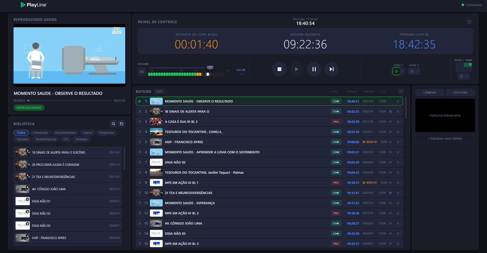

# PlayLine

> Sistema de playout para transmissão ao vivo — painel web, overlays em tempo real e automação por clipe.

**PlayLine** é um software de controle de playout em desenvolvimento para operações de transmissão de TV. O operador gerencia o roteiro de programação, os overlays de logo e texto e o volume, tudo por um painel web, com sincronização em tempo real via WebSocket.

O sistema foi projetado para ser operado sem conhecimento técnico aprofundado, com interface clara e comportamento previsível.



---

## Funcionalidades

### Roteiro de programação
- Drag & drop para reordenação de clipes
- Edição inline de título e adição de itens via biblioteca
- Cálculo em tempo real de horário de início, tempo restante e previsão do próximo clipe (exibição em `HH:MM:SS`)
- Duplicação de roteiro e limpeza com confirmação

### Overlays
- **Logo em dois slots simultâneos** — seleção de arquivo e posicionamento em qualquer dos quatro cantos da tela
- **Hora em tempo real** — renderizada via Pillow diretamente no output do MPV.
- **Temperatura e cidade** — via OpenWeatherMap API (atualização a cada 60 s), com fallback automático para wttr.in;
- **Automação por clipe** — cada vídeo do roteiro pode ter uma configuração independente de logos e textos, aplicada automaticamente ao iniciar a reprodução, sem alterar o estado global do painel de controle

### Player e áudio
- Preview ao vivo sincronizado com a posição exata do MPV
- VU meter de áudio em dBFS com peak hold e indicador de clip
- Fader de volume calibrado em dB (−10 dB a +3 dB)
- Recuperação silenciosa de clipes com erro — avança automaticamente sem intervenção do operador

### Biblioteca
- Navegação por pasta com carregamento de thumbnails gerados localmente
- Arrastar clipes da biblioteca diretamente para o roteiro
- Duração extraída automaticamente dos metadados de cada arquivo

---

## Arquitetura

PlayLine adota uma **arquitetura orientada a eventos** com três processos isolados — uma falha na interface não interrompe o sinal ao ar.

```
┌──────────────────┐        WebSocket         ┌───────────────────────┐
│  Painel Web      │  ◄──────────────────────► │  Playlist Engine      │
│  HTML / CSS / JS │    eventos assíncronos     │  Python + FastAPI     │
│  (navegador)     │                            │  localhost:8000       │
└──────────────────┘                            └───────────┬───────────┘
                                                            │ IPC / TCP
                                                            ▼
                                               ┌───────────────────────┐
                                               │  MPV Daemon           │
                                               │  Processo independente│
                                               │  localhost:6600       │
                                               └───────────┬───────────┘
                                                           │ HDMI
                                                           ▼
                                               TV / Switcher de hardware
```

**Fluxo típico:**
1. Operador clica "Próximo" no painel
2. Frontend envia ação via WebSocket
3. Playlist Engine avança o índice e instrui o Daemon via TCP
4. MPV emite `end-file` ao terminar → próximo clipe carrega automaticamente
5. Interface recebe `now_playing` e atualiza em tempo real

**Tolerância a falhas:** clipe corrompido ou inacessível → MPV sinaliza erro → sistema pula para o próximo item sem interromper a transmissão.

---

## Stack tecnológico

| Camada | Tecnologia |
|---|---|
| Motor de vídeo | MPV + python-mpv |
| Backend | Python 3.11 + FastAPI |
| Comunicação em tempo real | WebSocket (RFC 6455) |
| Renderização de overlays | Pillow → BGRA → MPV overlay-add |
| Temperatura | OpenWeatherMap API / wttr.in (fallback) |
| Interface | HTML + CSS + JavaScript — sem framework de build |
| Roteiro | JSON sincronizado em tempo real |
| Plataforma | Windows (principal) |

---

## Contexto acadêmico

PlayLine é desenvolvido como Trabalho de Conclusão de Curso (TCC) do curso de **Ciência da Computação** da **Universidade Federal do Tocantins (UFT)**.

- **Autor:** Henrique Noronha Fernandes
- **Orientador:** Prof. Dr. Edeilson Milhomem
- **Instituição:** Universidade Federal do Tocantins — Campus Palmas
- **Ano:** 2026

A motivação central é a democratização da infraestrutura de *broadcasting* para emissoras de pequeno porte, onde a televisão linear ainda é o principal meio de acesso à informação para parcela significativa da população.

---

## Licença

[MIT](LICENSE) — livre para usar, modificar e distribuir.

---

> *"O sinal precisa continuar no ar."*
