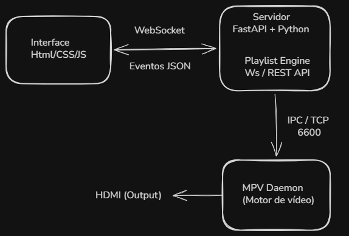

# PlayLine

> Sistema de automação de playout televisivo gratuito para emissoras de TV.

**PlayLine** é um sistema de automação de playout televisivo que organiza, reproduz e gerencia a programação da sua emissora de forma **contínua e automatizada**. Desenvolvido para emissoras que não podem arcar com soluções comerciais de alto custo e não dispõem de equipe técnica dedicada, sem abrir mão das funcionalidades essenciais.

🌐 **[playline.henrique-noronha.github.io/PlayLine](https://henrique-noronha.github.io/PlayLine/)** 

---

## Funcionalidades

### Biblioteca de Vídeos
- Geração automática de miniaturas
- Busca por nome em tempo real
- Suporta MP4, MKV, MXF, MTS, AVI, MOV e mais
- Organização por subpastas (Comerciais, Programas, Vinhetas…)

### Roteiro de Programação
- Monte a grade arrastando vídeos da biblioteca
- Reordene, remova e controle cada item com precisão
- Defina **ponto de entrada e saída** de cada clipe sem precisar editar o arquivo original
- Cálculo em tempo real de horário de início, tempo restante e previsão do próximo clipe
- Recuperação automática de clipes com erro — avança sem intervenção do operador

### YouTube
- Insira vídeos ou transmissões ao vivo do YouTube diretamente no roteiro
- Resolução automática da URL de stream via yt-dlp — sem download, reprodução direta
- Suporte a streams HLS (ao vivo) com reconexão automática em caso de falha

### Sobreposição de Logos
- Até 2 logotipos simultâneos em qualquer canto da tela
- Cada clipe do roteiro pode ter configuração independente de overlay
- Logo ativa e desativa automaticamente conforme o clipe — sem intervenção manual

### Hora e Temperatura
- Bloco de hora, temperatura e cidade sobrepostos ao vídeo em tempo real
- Seleção de 30 cidades brasileiras ou entrada manual
- Integração com OpenWeatherMap API, com fallback automático para wttr.in

### Histórico e Estatísticas
- Registro automático de cada exibição com data, hora e duração
- Aba **Registro**: listagem cronológica filtrável por data
- Aba **Estatísticas**: clipes mais exibidos (ranking completo), total de horas transmitidas e histórico de exibição por dia (30 dias)

### Preview em Tempo Real
- Monitore o que está sendo exibido diretamente na interface
- VU meter de áudio em dBFS com peak hold e indicador de clip
- Fader de volume calibrado em dB (−10 dB a +3 dB)

### Acesso Remoto
- Opere de qualquer máquina da rede via navegador (`http://<IP>:18000`)
- Ou use o **PlayLine-Client.exe** — aplicativo leve sem necessidade de instalar o servidor

---

## Arquitetura

PlayLine adota uma **arquitetura orientada a eventos** com três processos isolados — uma falha na interface não interrompe o sinal ao ar.

**Modos de acesso à interface:**
- **PlayLine.exe** — abre a interface automaticamente via pywebview (janela nativa, sem precisar abrir o navegador)
- **Navegador** — acesse `http://<IP>:18000` de qualquer dispositivo na mesma rede
- **PlayLine-Client.exe** — aplicativo leve para máquinas remotas; conecta ao servidor pelo IP

**Fluxo típico:**
1. Operador clica "Próximo" no painel
2. Frontend envia ação via WebSocket
3. Playlist Engine avança o índice e instrui o Daemon via TCP
4. MPV emite `end-file` ao terminar → próximo clipe carrega automaticamente
5. Interface recebe `now_playing` e atualiza em tempo real

**Tolerância a falhas:** clipe corrompido ou inacessível → MPV sinaliza erro → sistema pula para o próximo item sem interromper a transmissão.

---

## Stack tecnológico

| Camada | Tecnologia |
|---|---|
| Motor de vídeo | MPV + python-mpv |
| Backend | Python 3.13 + FastAPI |
| Persistência | SQLite (WAL mode) — roteiro, checkpoint e histórico |
| YouTube | yt-dlp — resolução de stream sem download |
| Interface nativa | pywebview (WebView2) |
| Comunicação em tempo real | WebSocket (RFC 6455) |
| Renderização de overlays | Pillow → BGRA → MPV overlay-add |
| Temperatura | OpenWeatherMap API / wttr.in (fallback) |
| Interface | HTML + CSS + JavaScript — sem framework de build |
| Distribuição | PyInstaller — sem instalação de Python |
| Plataforma | Windows 10 / 11 |

---

## Contexto acadêmico

PlayLine é desenvolvido como Trabalho de Conclusão de Curso (TCC) do curso de **Ciência da Computação** da **Universidade Federal do Tocantins (UFT)**.

- **Autor:** Henrique Noronha Fernandes
- **Orientador:** Prof. Dr. Edeilson Milhomem
- **Instituição:** Universidade Federal do Tocantins — Campus Palmas
- **Ano:** 2026

A motivação central é a democratização da infraestrutura de *broadcasting* para emissoras de pequeno porte, onde a televisão linear ainda é o principal meio de acesso à informação para parcela significativa da população.

---

## Contato e Suporte

- 📧 **playline.suporte@gmail.com**
- 🌐 **[henrique-noronha.github.io/PlayLine](https://henrique-noronha.github.io/PlayLine/)**
- 🐛 **[Issues no GitHub](https://github.com/henrique-noronha/PlayLine/issues)**

---

## Licença

Este projeto é licenciado sob a GPLv3 — veja o arquivo
[LICENSE](LICENSE) para detalhes.

## Contribuições

Contribuições são bem-vindas via Pull Request. Toda
modificação proposta será analisada pelo autor antes da
aprovação. Consulte [CONTRIBUTING.md](CONTRIBUTING.md) para as diretrizes.

## Marca

O nome "PlayLine" e o logotipo associado são de uso
exclusivo deste projeto. Forks e derivações devem adotar
nome e identidade visual próprios.

---

> *"O sinal precisa continuar no ar."*
