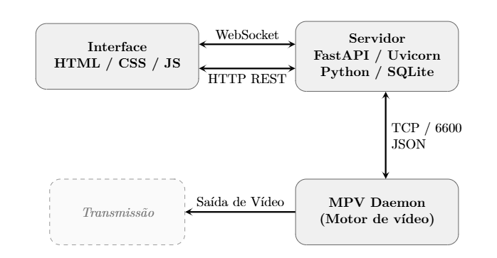

# PlayLine

> Sistema de automação de playout televisivo gratuito para emissoras de TV.

**PlayLine** é um sistema de automação de playout televisivo que organiza, reproduz e gerencia a programação da sua emissora de forma **contínua e automatizada**. Desenvolvido para emissoras que não podem arcar com soluções comerciais de alto custo e não dispõem de equipe técnica dedicada, sem abrir mão das funcionalidades essenciais.

🌐 **[henrique-noronha.github.io/PlayLine](https://henrique-noronha.github.io/PlayLine/)**

---

## Primeiros passos

1. Baixe o `.zip` da [última release](https://github.com/henrique-noronha/PlayLine/releases) e extraia em qualquer pasta (a instalação é portátil: banco, configurações e biblioteca ficam ao lado do `PlayLine.exe`).
2. Copie seus vídeos para a pasta `Biblioteca`, ou escolha outra pasta depois em **Configurações > Biblioteca**.
3. Preferencialmente antes de iniciar o software, conecte o segundo monitor (ou a placa de saída) ao computador: o sinal de saída vai para ele automaticamente. 
4. Abra `PlayLine.exe` e entre com o usuário `playline` e a senha `playline`.
5. Troque usuário e senha em **Configurações** (menu do Painel de Controle). 

Requisitos: Windows 10/11 x64, [Visual C++ Redistributable](https://aka.ms/vs/17/release/vc_redist.x64.exe) e [WebView2 Runtime](https://developer.microsoft.com/microsoft-edge/webview2/) (ambos gratuitos, normalmente já presentes).

---

## Funcionalidades

### Biblioteca de Vídeos
- Geração automática de miniaturas
- Busca por nome em tempo real
- Suporta MP4, MKV, MXF, MTS, AVI, MOV e mais
- Organização por subpastas (Comerciais, Programas, Vinhetas…)

### Roteiro de Programação
- Monte a grade arrastando vídeos da biblioteca
- Reordene, remova e controle cada item com precisão
- Defina **ponto de entrada e saída** de cada clipe sem precisar editar o arquivo original
- Cálculo em tempo real de horário de início, tempo restante e previsão do próximo clipe
- **Transições** CUT (corte seco) ou FTB (fade to black), globais pelo botão no cabeçalho do roteiro ou por clipe no menu ⚙, com duração configurável
- Próximo clipe pré-carregado na fila do MPV: a troca acontece sem tela preta
- **Roteiros salvos**: salve, carregue e duplique grades; modo **repetir** para roteiros em loop
- Recuperação automática de clipes com erro ou travados: avança sem intervenção do operador

### YouTube
- Insira vídeos ou transmissões ao vivo do YouTube diretamente no roteiro
- Resolução automática da URL de stream via yt-dlp — sem download, reprodução direta
- Suporte a streams HLS (ao vivo) com reconexão automática em caso de falha
- URL pré-resolvida e stream pré-carregado enquanto o clipe anterior toca: entrada na live sem espera

### Entrada de Vídeo
- Captura ao vivo de qualquer dispositivo conectado — webcam, placa de captura, câmera HDMI
- Detecção automática dos dispositivos disponíveis via DirectShow (Windows)
- O dispositivo é tratado como item ao vivo no roteiro, com reconexão automática em caso de falha de sinal
- Quadrante de preview ao lado do roteiro para monitorar a câmera ou a live do YouTube antes de entrar no ar

### Sobreposição de Logos
- Até 2 logotipos simultâneos com tamanho padrão do arquivo original.
- Cada clipe do roteiro pode ter configuração independente de overlay
- Logo ativa e desativa automaticamente conforme o clipe — sem intervenção manual

### Hora e Temperatura
- Bloco de hora, temperatura e cidade sobrepostos ao vídeo em tempo real
- Seleção de 30 cidades brasileiras ou entrada manual
- Integração com OpenWeatherMap API, com fallback automático para wttr.in

### Histórico e Estatísticas
- Registro automático de cada exibição com data, hora e duração
- Aba **Registro**: listagem cronológica filtrável por data
- Aba **Estatísticas**: clipes mais exibidos (ranking completo), total de horas transmitidas e histórico de exibição por dia.

### Preview em Tempo Real
- Monitore o que está sendo exibido diretamente na interface
- VU meter de áudio em dBFS com peak hold e indicador de clip
- Fader de volume calibrado em dB (−20 dB a +6 dB)

### Acesso Remoto
- Opere de qualquer máquina da rede via navegador (`http://<IP>:18000`)
- Ou use o **PlayLine-Client.exe**, aplicativo leve sem necessidade de instalar o servidor
- Fora da rede da emissora, use uma VPN (Tailscale, WireGuard etc.): o servidor nunca precisa ser exposto à Internet

### PlayIngest
- Aplicativo separado (`PlayIngest.exe`) para enviar vídeos à biblioteca a partir de qualquer máquina da rede
- Informe o IP do servidor, faça login com as mesmas credenciais e arraste os arquivos; escolha a subpasta de destino
- Verifica espaço em disco e permissões antes de gravar

### Configurações e Segurança
- Acesso protegido por usuário e senha (padrão `playline`/`playline`), exigidos também nas conexões WebSocket e nos aplicativos auxiliares
- Troca de usuário e senha pela própria interface, mediante confirmação das credenciais atuais; a senha é guardada apenas como hash (PBKDF2-SHA256 com salt)
- Pasta da biblioteca configurável: qualquer pasta do computador, inclusive HD externo, com seletor nativo do Windows
- Sessões de 8 horas; trocar a senha derruba as demais sessões abertas

### Transmissão sem operador
- Retomada automática do ponto em que parou após queda de energia ou reinício inesperado (checkpoint contínuo)
- Reabertura automática do item atual se o MPV encerrar no meio da reprodução
- Watchdog de clipe travado e de live sem sinal, com avanço ou reconexão sem intervenção
- Supervisor do servidor na janela nativa e `install_autostart.bat` para iniciar o PlayLine junto com o Windows

---

## Arquitetura

PlayLine adota uma **arquitetura orientada a eventos** com três processos isolados, uma falha na interface não interrompe o sinal ao ar.

**Modos de acesso à interface:**
- **PlayLine.exe** — abre a interface automaticamente via pywebview (janela nativa, sem precisar abrir o navegador)
- **Navegador** — acesse `http://<IP>:18000` de qualquer dispositivo na mesma rede
- **PlayLine-Client.exe** — aplicativo leve para máquinas remotas; conecta ao servidor pelo IP

**Fluxo típico:**
1. Operador clica "Próximo" no painel
2. Frontend envia ação via WebSocket
3. Playlist Engine avança o índice e instrui o Daemon via TCP
4. O próximo clipe já está pré-carregado na fila do MPV: ao terminar, a troca é imediata (CUT) ou com fade para o preto (FTB)
5. Interface recebe `now_playing` e atualiza em tempo real

**Tolerância a falhas:** clipe corrompido ou inacessível → MPV sinaliza erro → sistema pula para o próximo item sem interromper a transmissão. Se o servidor cair, o daemon segue tocando e é reconectado; se o MPV cair, o item atual é reaberto; se a máquina reiniciar, o playout retoma do checkpoint.

**PlayIngest** é um quarto processo, independente e opcional: roda em qualquer máquina da rede e conversa com o servidor apenas pela API HTTP autenticada.

---

## Stack tecnológico

| Camada | Tecnologia |
|---|---|
| Motor de vídeo | MPV + python-mpv |
| Backend | Python 3.13 + FastAPI |
| Persistência | SQLite (WAL mode): roteiro, checkpoint, histórico e roteiros salvos; `config.json`: credenciais, biblioteca e transições |
| YouTube | yt-dlp: resolução de stream sem download |
| Interface nativa | pywebview (WebView2) |
| Comunicação em tempo real | WebSocket (RFC 6455), autenticado por sessão |
| Renderização de overlays | Pillow → BGRA → MPV overlay-add; transições FTB via osd-overlay (ASS) |
| Autenticação | Sessão por cookie HttpOnly; senha com PBKDF2-HMAC-SHA256 |
| Temperatura | OpenWeatherMap API / wttr.in (fallback) |
| Interface | HTML + CSS + JavaScript — sem framework de build |
| Distribuição | PyInstaller — sem instalação de Python |
| Plataforma | Windows 10 / 11 |

---

## Contexto acadêmico

PlayLine é desenvolvido como Trabalho de Conclusão de Curso (TCC) do curso de **Ciência da Computação** da **Universidade Federal do Tocantins (UFT)**.

- **Autor:** Henrique Noronha Fernandes
- **Orientador:** Prof. Dr. Edeilson Milhomem
- **Instituição:** Universidade Federal do Tocantins — Campus Palmas
- **Ano:** 2026

A motivação central é a democratização da infraestrutura de *broadcasting* para emissoras de pequeno porte, onde a televisão linear ainda é o principal meio de acesso à informação para parcela significativa da população.

---

## Contato e Suporte

- 📧 **playline.suporte@gmail.com**
- 🌐 **[henrique-noronha.github.io/PlayLine](https://henrique-noronha.github.io/PlayLine/)**
- 🐛 **[Issues no GitHub](https://github.com/henrique-noronha/PlayLine/issues)**

---

## Licença

Este projeto é licenciado sob a GPLv3 — veja o arquivo
[LICENSE](LICENSE) para detalhes.

## Contribuições

Contribuições são bem-vindas via Pull Request. Toda
modificação proposta será analisada pelo autor antes da
aprovação. Consulte [CONTRIBUTING.md](CONTRIBUTING.md) para as diretrizes.

## Marca

O nome "PlayLine" e o logotipo associado são de uso
exclusivo deste projeto. Forks e derivações devem adotar
nome e identidade visual próprios.

---

> *"O sinal precisa continuar no ar."*
